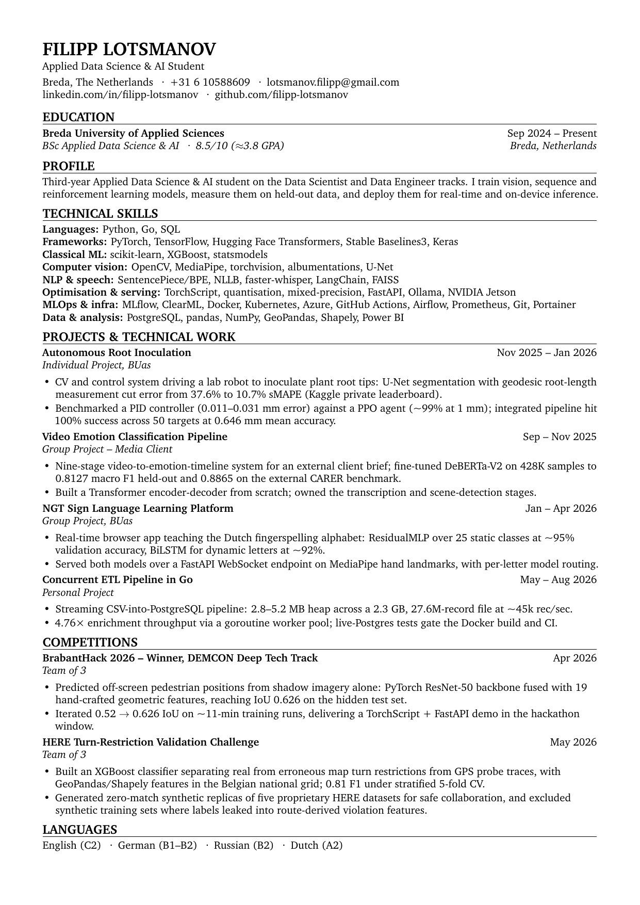

# Filipp Lotsmanov - CV

Applied Data Science & AI student at Breda University of Applied Sciences.
Computer vision, MLOps and concurrent systems.

**[Download the PDF](https://github.com/filipp-lotsmanov/resume/releases/latest/download/Filipp_Lotsmanov_CV.pdf)**
&nbsp;·&nbsp;
[View in the repo](resume.pdf)
&nbsp;·&nbsp;
[linkedin.com/in/filipp-lotsmanov](https://linkedin.com/in/filipp-lotsmanov)
&nbsp;·&nbsp;
lotsmanov.filipp@gmail.com

<a href="resume.pdf">
  
</a>

## How this is built

The PDF is compiled from `resume.tex` by GitHub Actions on every push to `main`,
then committed back to the repository, so the file above is always current with
the source. The preview image is rendered from that same PDF after it passes
verification.

```
make          # compile, then run the checks below
make pdf      # compile only
make watch    # recompile on save
make tools    # report any missing TeX packages or binaries
```

The engine must be `pdflatex`. `\pdfgentounicode` and `\input{glyphtounicode}`
are pdfTeX primitives and error out under `xelatex` or `lualatex`.


## Layout

```
resume.tex               source
resume.pdf               compiled output, committed by CI
docs/preview.png         page-1 render, committed by CI
scripts/verify.py        PDF invariant checks (PEP 723, no project files needed)
Makefile                 build, verify, watch, clean
.latexmkrc               pins the engine to pdflatex
.github/workflows/       compile, verify, commit, release on tags
```

Tagging a commit `v*` attaches the PDF to a GitHub release under both a
version-stamped name and the constant name used by the download link above.
